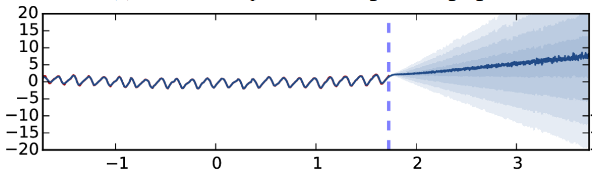
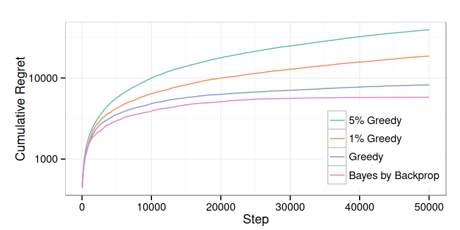

# A Survey of Neural Network Architectures for Enhanced Predictive Uncertainty Estimation

## Abstract
Uncertainty awareness is a critical capability for artificial intelligence agents to ensure they make safe, rational decisions in applications where robustness matters. This survey covers two major lines of work in improving the predictive uncertainty estimation capabilities of deep learning architectures, Bayesian neural networks (BNN) and epistemic neural networks (ENN).

## Introduction
Uncertainty awareness is a critical prerequisite to many intelligent behaviors such as identifying avenues for further learning and accurately gauging one’s confidence in one’s decisions. Unfortunately, standard deep learning architectures tend to both underestimate their uncertainty and fail to identify its sources. This lack of uncertainty awareness often results in overconfidence in wrong, potentially harmful decisions \[1\]. As deep learning is posed to be deployed in safety-critical applications, like autonomous driving \[2\] and medical imaging \[3\], this deficiency becomes an increasingly pressing issue. Presented in this survey are two major lines of current work to improve the predictive uncertainty estimations of deep learning architectures: Bayesian neural networks (BNN) and epistemic neural networks (ENN). 

## Bayesian Neural Networks

BNNs consist of two components, a base neural architecture $f_w$ with parameters $w$ and a probability distribution over those parameters $q$. The model uses this probability distribution to make predictions and to quantify its uncertainty on those predictions. To make a prediction on some input $x$, a BNN computes the expectation 

$$\mathbb{E}_{w \sim q} f_w(x)$$

To generate the probability distribution over its parameters, a BNN begins with some predefined prior probability over its weights which is then conditioned on the training data form a posterior. Using exact Bayesian inference to compute the posterior is prohibitively expensive due to the high dimensionality of state-of-the-art neural architecture parameter spaces \[4\]. So, all BNNs compute some approximation of the posterior and BNN architectures primarily differ based on which approximation they employ. The difficulty of creating a BNN architecture lies in designing an approximation that balances fidelity to the true posterior and computational tractability. Two major types of approximation employed in current research are variational approaches \[5, 6\] and sample-based approaches \[7\].

### Variational Approaches

Variational inference seeks to model the true posterior over the model’s weights with a similar, but more computationally tractable distribution. This is achieved by defining a set of parameterized density functions and optimizing the parameters to minimize Kullbeck-Lieber (KL) divergence with respect to the posterior. The exact set of density functions and minimization procedure used is architecture-dependent \[8\]. This survey covers two variational inference-based methods: Bayes by Backprop and MC-Dropout.

#### MC-Dropout
Dropout is a feature in which a network's inputs and/or hidden layer nodes are randomly set to 0 with some probability $p$. The MC-Dropout BNN \[5\] architecture adds and tunes dropout on its base network to simulate the network's behavior over the true posterior. Specifically, the random variable $W_i$ in the true posterior corresponding to the weights of the i-th layer is approximated by 

$$ W_i = M_i \cdot \text{diag}([z_{i,j}]_{j=1}^{K_i})$$

$$ z_{i,j} = \text{Bernoulli}(p_i)$$

where $L$ is the number of layers and $K_i$ is the dimensionaltiy of the $i$-th layer. This representation corresponds to some base weight matrix $M_i$ having its features randomly dropped out with probability $p_i$. The base matrices $M_i$ and the dropout probabilities $p_i$ are optimized to minimize an approximation of KL divergence with the true posterior \[5\].

Once the dropout approximation is fit, predictions and uncertainties are computed using the following Monte Carlo approximation of the expectation over the random variables $W_i$. $T$ independent samples of the random variables $W_i$ are drawn to form $T$ parameter sets $[\phi_1, ..., \phi_T]$. The prediction on some input $x$ is then computed as

$$\hat{f}(x) =  \frac{1}{T} \sum_{t=1}^{T} f_{\phi_t}(x)$$

which corresponds to averaging the models output over $T$ different runs with independently drawn dropout patterns. The uncertainty of this prediction is measure as

$$\text{Var}_{f(x)} = \tau^{-1}\mathbb{I} + \frac{1}{T} \sum_{t=1}^{T} \left(f_{\phi_t}(x)^T f_{\phi_t}(x)\right) - \hat{f}(x)^T \hat{f}(x)$$

where $\tau$ is a measure of model precision determined by the network's hyperparameters \[5\].

*Figure 1: MC-Dropout's \[5\] performance on a regression task. The dark blue line represents the networks predicted values and the shaded blue region represents the likely values based on the networks uncertainty estimate at that point. The dotted blue line represents the edge of the networks training data. Figure by \[5\]*

On an MNIST \[10\] handwritten digit classification task, the MC-Dropout architecture was demonstrated to have appropriately uncertain (diffuse over multiple classes) softmax probability predictive distribution on ambiguous inputs. When used to extrapolate beyond its training data on a regression task, the MC-Dropout architecture had inaccurate predictive outputs but correctly returned that it was highly uncertain. A particularly interesting result, seen in the figure above, is that the architecture reported an increasingly higher uncertainty as it extrapolated further past its training data \[5\].

However, another paper demonstrated that dropout methods may be approximating the risk of a model rather than its uncertainty \[7\]. Whereas uncertainty is a model's confusion over which parameters are optimal, the risk of a model is an inherent limit in how much variation a model can accurately predict. Risk stems from randomness in the problem that the model is too simple to capture. Quanitfying risk is less useful for a learning model than uncerstainty because risk cannot be resolved without a change in architecture \[7\].

#### Bayes by Backdrop

The Bayes by Backdrop \[6\] BNN architecture utilizes one of two gaussian-based approximations of the posterior. The first is a standard diagonal Gaussian $\mathcal{N}(0, \mathbb{I})$ who's mean and variance are shifted by variational parameters $\mu, p$ that are refined to minimize a KL divergence objective from the true posterior. The second is a mixed-scale distribution formed by the combination of two zero-mean Gaussians with different variances. The mean and variance of this distribution is also shifted by variational parameters $\mu, p$ that are refined to minimize a KL divergence objective from the true posterior \[6\].

*Figure 2: Bayes by Backdrop \[6\] (left) and a standard neural network (right) on a curved regression task. The red line is the predicted value and the green/purple shaded area is the interquartile range determined by the networks uncertainty estimate at that point. Black x's are the networks' training data points. Figure by \[6\]*

Training on a curved regression task demonstrated that Bayes by Backdrop had more reasonable uncertainty estimates that a standard neural network. The above figure shows that the Bayes by Backdrop correctly indicates that its uncertainty increases as it predicts further away from its training data. The neural network, on the other hand, overconfidently estimates that its uncertainty decreases as it extrapolates further past its training data \[6\]. 

*Figure 3: Bayes by Backdrop \[6\] performance on mushroom bandit task compared with various greedy models. Figure by \[6\]*

Bayes by Backprop was also shown to outperform other algorithms on decision problems. The architecture was tested on a bandit problem in which it chooses a mushroom to eat, being rewarded for selecting edible mushrooms and punished for eating poisonous mushrooms. The regret of the model was measured as the difference between its earned reward and the maximum reward earned by an oracle agent. On this task, the Bayes by Backprop agent outperformed various greedy agents, achieving lower regret than all as seen in the figure above \[6\]. 

### Sample Approches

Rather than approximating the posterior with a simpler distribution, sample-based approaches approximate the true posterior with a finite sample of that posterior. These models use this sample to compute sample-based approximations of expectations over the true posterior. Directly sampling the high-dimensional, complex posteriors of deep learning parameters is intractable so the difficulty in creating these models lies in formulating an efficient sampling method. These methods must be both efficient in time required to sample and the number of samples needed to achieve a good approximation of the true posterior.

#### Deep Ensemble

The Deep Ensemble architecture \[9\] trains multiple instantiations of the same base neural architecture. Each of these instantiations has a different parameter setting and together they form a sample over the posterior of all possible parameter settings. Unlike many other ensemble methods, these models are all trained on the entire set of data. The authors found that initializing each model randomly and shuffling the order of the training data for each network was enough to sufficiently spread the ensemble across the posterior \[9\]. 

For classifcation, the networks are trained using a proper scoring rule since these reward accurate predictive distributions. Examples of proper scoring rules include negative log loss and Brier score. For regression, the networks are configured to output two values, a predicted mean and predicted variance at that point, and trained to minimize the loss MATH.

Some variants of Deep Ensembles are also presented in the paper. These include a Deep Ensemble with adversarial training where sytnthetic examples that the model is likely to misclassify are generated and used during training. These synthetic examples are created by perturbing existing training examples in directions where the model's loss is increasing \[9\].

*Figure 4: The predictive accuracy of Deep Ensemble \[9\] variants and MC-Dropout\[5\] on augmented MNIST dataset as a function of their predictive confidence. Figure by \[9\]*

Deep Ensembles \[9\] were demonstrated to have more accurate confidence estimates than MC-Dropout \[5\]. In this experiment, both architectures were trained on the MNIST dataset \[10\]. Images of non-MNIST digits were incorportated into the test set to measure the difference in model behavior both in and out-of-distribution. At each test point, the model's confidence was measured as the softmax probabilty the model assigned to its prediction. In the figure above, each model's accuracy was plotted as a function of its confidence. Deep Ensemble's accuracy more consistently increases as its confidence increases, suggesting its confidence levels are more accurate than MC-Dropout's \[9\]. 

## Epistemic Neural Networks

Epistemic neural networks \[11\] aim to enhance the uncertainty awareness of deep learning architectures by enabling them to better discern the source of their uncertainty. Specifically, ENNs aim to differentiate between epistemic uncertainty, which stems from a model's own lack of knowledge, and aleatoric uncertainty, which stems from genuine ambiguity in the input. To distinguish between these, an ENN examines the structure of a model's joint predictions. Unlike marginal predictions which predict the class of a single input, joint predictions are the combined probability distribution over the classifcation classes for a set of multiple inputs.  As seen in the figure below, a diffuse joint prediction indicates aleatoric uncertainty, whereas a joint prediction with more conditional structure implies epistemic uncertainty \[11\]. 

*Figure 5: A basic image classification problem demonstrating the type of joint prediction distributions that indicate aleatoric/epistemic uncertainty respectively. Figure \[11\]*

Standard neural arhcitectures were built to make mariginal predictions so their joint prediction model is very unexpressive, always being the product of the marginal predictions. In order to use the joint prediction to distinguish between types of uncertainty, ENNs must have a more expressive method of computing joint predictions so that different conditional structures can be output. This is achieved via the introduction of an epistemic index $z$. The epistemic index is a latent input that the ENN samples from some pre-specified distribution $P_z$. The joint predicted probability for a set of labels $y_{1:t}$ for a set of inputs $x_{1:t}$ will then be computed as 

$$p(y_{1:t}) = \int P_z(z) \prod_{i=1}^t \text{softmax}(f(x_i, z))_{y_i} dz$$

Depending on how the model's output varies with respect to $z$, different joint predictions conditional structures can be achieved. As seen in the figure below, a model who's output does not vary with $z$ will have an independent joint prediction structure where as a model that does vary with $z$ will have a more conditional structure \[11\]. 

*Figure 6: Basic image classification task demonstrating how the variation of an ENN's output with respect its epistemic index can induce different joint prediction conditional structures. Figure by \[11\]*

This more expressive achitecture allows ENNs to make more accurate joint predictions, which has been shown to lower regret in decision making problems \[12\].

### Epinet

The Epinet \[11\] is an ENN that can be combined with a base neural network to form a combined ENN. The Epinet $\phi$ is added to a neural network $f$ to form the combined ENN $f^\*$ as 
$$f^\*(x, z) = f(x) + \phi(f'(x), z)$$

where $f'(x)$ are intermediate features of the network $f(x)$. The epinet can be added to already trained models. 

The epinet is composed of two components, a prior network and a learned network. The output of the prior network and the learned network are added to produce the output of the epinet. The prior network is initialized and never trained, representing prior uncertainty in the network. The learned network is trained and learns to tune its outputs so that network outputs likely predictions $f^\*(x, z)$ for some input $x$ for all probable values of $z$.

The epinet is trained using stochastic gradient descent and an Monte Carlo approximation of the integral over the epistemic index $z$. The epinet can be trained using standard, marginal predication-based loss functions. Another paper demonstrated that training with marginal loss functions perturbed by random priors can induce good joint predictions. In the case of the epinet, its loss function is perturbed by its randomly intialized prior network.

*Figure 7: Performance of the epinet \[11\] and multiple BNN architectures \[5, 6, 9, 13, 14\] on the synthetic neural testbed \[15\] dataset. Figure by \[11\]*

The epinet \[11\] was shown to outperform or match many BNN architectures \[5, 6, 9, 13, 14\] on a synthetic classification dataset generated using the neural testbed\[15\]. As seen in the figure above, the epinet achieved the best computational cost to performance ratio by a wide margin on joint log loss.

## Conclusion

Uncertainty awareness is an essential skill for artificial intelligence that enables many important capabilities like effective exploration and accurate confidence estimation. We present two major avenues of current research into enhancing the uncertainty quantification of deep learning architectures. Utilizing a posterior of the parameters of a base network, Bayesian neural networks quantify their uncertainty more accurately than basic neural arhcitectures and make predictions that account for uncertainty. Epistemic neural networks use accurate, expressive joint predictions to distinguish between different sources of uncertainty.

## Bibliography

\[1\] Amodei, Dario, et al. "Concrete problems in AI safety." arXiv preprint arXiv:1606.06565 (2016).

\[2\] Grigorescu, Sorin, et al. "A survey of deep learning techniques for autonomous driving." Journal of Field Robotics 37.3 (2020): 362-386.

\[3\] Akay, Altug, and Henry Hess. "Deep learning: current and emerging applications in medicine and technology." IEEE journal of biomedical and health informatics 23.3 (2019): 906-920.

\[4\] Neal, Radford M. Bayesian learning for neural networks. Vol. 118. Springer Science & Business Media, 2012.

\[5\] Gal, Yarin, and Zoubin Ghahramani. "Dropout as a bayesian approximation: Representing model uncertainty in deep learning." international conference on machine learning. PMLR, 2016.

\[6\] Blundell, Charles, et al. "Weight uncertainty in neural network." International conference on machine learning. PMLR, 2015.

\[7\] Osband, Ian. "Risk versus uncertainty in deep learning: Bayes, bootstrap and the dangers of dropout." NIPS workshop on bayesian deep learning. Vol. 192. 2016.

\[8\] Blei, David M., Alp Kucukelbir, and Jon D. McAuliffe. "Variational inference: A review for statisticians." Journal of the American statistical Association 112.518 (2017): 859-877.

\[9\] Lakshminarayanan, Balaji, Alexander Pritzel, and Charles Blundell. "Simple and scalable predictive uncertainty estimation using deep ensembles." Advances in neural information processing systems 30 (2017).

\[10\] LeCun, Yann, Corinna Cortes, and Chris Burges. "MNIST handwritten digit database." (2010): 18.

\[11\] Osband, Ian, et al. "Epistemic neural networks." arXiv preprint arXiv:2107.08924 (2021).

\[12\] Wen, Zheng, et al. "From predictions to decisions: The importance of joint predictive distributions." arXiv preprint arXiv:2107.09224 (2021).

\[13\] Welling, Max, and Yee W. Teh. "Bayesian learning via stochastic gradient Langevin dynamics." Proceedings of the 28th international conference on machine learning (ICML-11). 2011.

\[14\] Dwaracherla, Vikranth, et al. "Hypermodels for exploration." arXiv preprint arXiv:2006.07464 (2020).

\[15\] Osband, Ian, et al. "The neural testbed: Evaluating joint predictions." Advances in Neural Information Processing Systems 35 (2022): 12554-12565.

